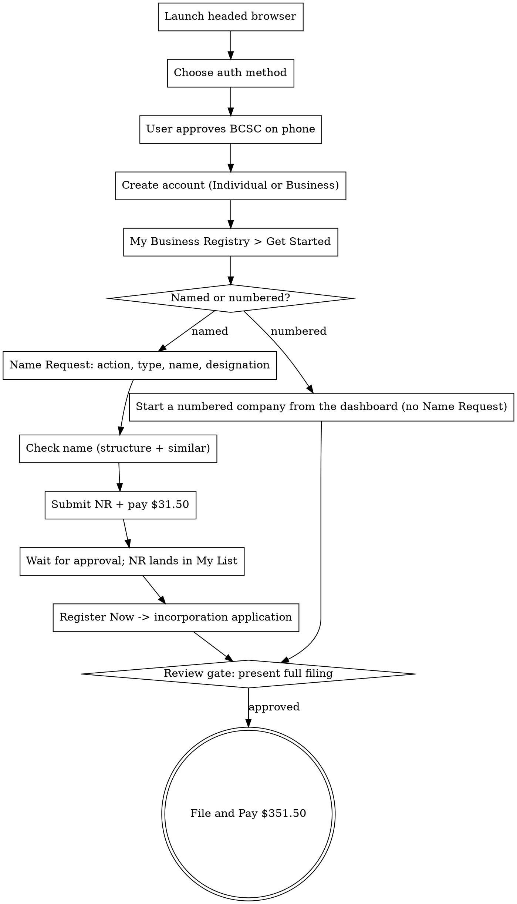

# bc-incorporation

Drives the BC Registries incorporation flow end to end with
[agent-browser](https://github.com/...): BC Services Card login → account
creation → Name Request (named) → incorporation application → File and Pay.

**Not for**: societies/co-ops/ULCs (different forms), extraprovincial
registration, or drafting custom share articles — that is legal work, get a
professional.

## Non-negotiable rules

1. **Zero PII in this skill or on disk.** Every name, address, email, and
   corporate answer comes from the live conversation. Never write real values
   into the skill, logs, or committed files.
2. **Never auto-submit or auto-pay.** Two money gates — Name Request
   (~$31.50) and File and Pay (~$351.50). Each one waits for explicit user
   approval. A filing is a legal act.
3. **The phone step belongs to the human.** BC Services Card login approves in
   the mobile app on the user's phone. The agent drives the desktop browser;
   the user does the biometric tap. Do not work around it.
4. **Ask before you choose.** Named vs numbered, designations, share
   structure, directors — surface the decision, do not guess.

## Key facts (verified Sept 2026)

| Fact | Value |
|---|---|
| Entry point | `bcregistry.gov.bc.ca` → BC Registries Account |
| Login | BC Services Card app, or username/password + BC Token. BCSC has **no password** — save only account metadata |
| Account | Individual Person fits a first-time founder; Business asks industry type + size. Either can hold the new corp |
| Name Request | `names.bcregistry.gov.bc.ca` (the old `namerequest.gov.bc.ca` DNS is dead). $30 + $1.50 service; priority $130 + $1.50 |
| NR validity | Approved NR held **56 days** — incorporate before expiry |
| Name choices | Up to **3 ranked names** per request |
| Incorporation fee | **$351.50** by credit card; future effective date (≤10 days out) +$100 |
| People required | Completing Party + ≥1 Incorporator + ≥1 Director — one person can hold all three roles |
| Shares | ≥1 class required; standard pick: unlimited common, no par value, no special rights |
| Offices | Registered + Records office; each needs a BC **delivery** address (no PO box); mailing may differ |
| Service times | Banner posts current waits (observed: ~7 days standard NR, ~5 days priority) |
| Official guide | `guide_how_to_incorporate_a_named_company.pdf` on www2.gov.bc.ca — mirrors this flow |

## Workflow



A numbered company has no Name Request, so it never gets the "Register Now"
action in My List. Start it from the Business Registry dashboard's
numbered-company option instead. The live session did not walk this path, so
read the exact label from the snapshot before you click.

### Step 1 — Launch headed

The user must watch (and tap their phone at login). Use the personal
real-Chrome clone so the session is headed and prompt-free:

```bash
zsh -ic 'browser-personal open "https://www.bcregistry.gov.bc.ca/en-CA"'
```

### Step 2 — Auth (`account.bcregistry.gov.bc.ca/choose-authentication-method`)

Two buttons: **Log in with BC Services Card app** (normal path — user opens
the app, approves, browser continues) or **Username/password + BC Token**.
There is no password to store on the BCSC path; after login, save account
metadata (account number, account name, access type) instead of a password.

### Step 3 — Create account (`setup-account`)

Radio: **Individual Person** / Business / Government Agency. Individual is the
fit for a first-time founder — the corporation still gets created inside it.
Business adds Legal Business Name, Business Type (industry list —
GENERAL BUSINESS for software), Business Size, and Country (a readonly
~250-entry select). Full field map: `references/field-map.md`.

### Step 4 — Dashboard → Name Request

My Business Registry → **Open** → **Get Started with a B.C. Based Business**,
or the landing page's **Request a Name**. In Name Request: Action =
"Start a new BC-based business" → business type → **Named Company** → enter
name + designation → **Check this Name**.

Two automated checks run: **Name Structure** (distinctive + descriptive +
designation) and **Similar Name** (lists look-alikes; "Attention Required" is
informational — the human examiner decides). A coined word alone trips
"Ensure there is a descriptive element"; add a descriptor. The check is not
exhaustive — read the similar list, not just the badge.

### Step 5 — Incorporation application

Approved NR → My List → **Register Now**. Steps: NR confirm + translated-name
checkbox → Registered Office → Records Office → contact email (+optional
phone, folio) → People and Roles → Share Structure → Agreement & Articles
(sample or custom) → Review → effective date → Certify → **File and Pay**.

### Step 6 — Review gate (mandatory)

Before File and Pay, print the complete filing table — name + designation,
both offices, all people and roles, every share class, effective date, total
fees — and wait for explicit approval. Then file, and capture the
incorporation number (`BC#######`) plus the document set from the company
dashboard's history.

## Gotchas

`references/agent-browser-gotchas.md` — Vuetify v-selects are readonly
(single real click opens; double synthetic clicks toggle it shut), lists are
virtualized (a11y tree hides options — dump the DOM), `.loading-container`
keeps intercepting clicks while invisible, deep links into
`business.bcregistry.gov.bc.ca` boot an empty `#app` (enter via the account
dashboard), and cloned-profile session restore spawns unrelated tabs that
steal focus.

## Security

The BCSC approval is the credential. There is no password to exfiltrate, but
never type credit-card numbers yourself — hand the window to the user at the
payment step. A filed incorporation is public record; confirm the user
understands the registered-office address becomes public.
