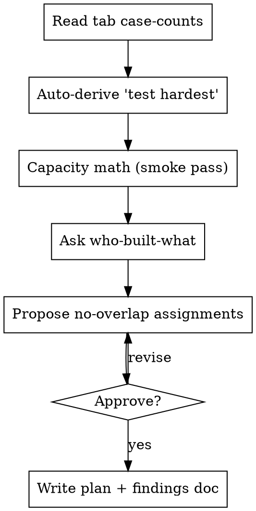

# Bug Bash Setup

Turn a tester roster + a time budget into balanced, no-overlap assignments and a ready-to-use plan + findings-log doc. A bug bash is a **smoke pass, not full regression** — run each case's main happy path fast, flag what's broken, leave unreached cases blank. Pairs with **bug-bash-triage**.

Linear-flavored (doc + `LINEAR_API_KEY`); adapt the doc API for another tool.

## When to use

- Scheduling a bug bash before a release.
- "Plan the bug bash", "assign areas", "who tests what".
- NOT for triaging results → use **bug-bash-triage**.

## Inputs (ask for what's missing)

- **Version / release**.
- **Testers** — names + count (map to tracker users).
- **Time budget** — person-hours (e.g. 9 × 2h = 18).
- **Who-built-what** — so owners do NOT test their own area (they miss their own bugs).
- **Test suite** — the spreadsheet of test cases (one tab per area). Confirm it's current.

## Process

### 1. Read tab case-counts
If the suite is a Google Sheet, each tab exports as CSV: `…/export?format=csv&gid=<GID>`. Count data rows per tab → sizing input. Note the test-ID convention (often **row order within a tab** if there's no explicit ID column).

### 2. Auto-derive "test these hardest"
Rank the areas most likely broken this release and present the list:
- **Code churn**: `git log <release-start>..HEAD --oneline -- <area paths>` — high commit counts = high risk.
- **Recent bug/reopen counts** per area from the tracker this cycle.

### 3. Capacity math
Compare person-hours to the full-suite estimate; state plainly it's a smoke pass and which areas won't be reached. Call out an **async track** for anything that can't be tested live (real DNS/SSL/propagation, real purchases, long-running jobs).

### 4–5. Assignments — two enforced rules
**(1) One owner per area, no overlap. (2) Nobody tests what they built this release.** Propose assignments balancing case-count + churn, front-loading the "test hardest" list. Show the table; iterate to approval.

### 6. Write the plan + findings-log doc
Create the doc with: when/where + suite links + "only log bugs"; a **Read first** smoke-pass framing + the two rules; **Test these hardest** (with the churn/bug rationale); the **async track** + owner; a **who-owns-what** checklist (one row per owner, linking their area + case count); and the **findings log** — the Type taxonomy (**Bug · Test problem · Missing variation · Missing test case · Unclear · Polish**) plus one table per tester:
`| Test ID | Area | Type | Severity | What happened vs expected | Reporter | Screenshot/link |`

Don't create issues here — that's triage.

## Common mistakes

- Letting owners test their own area (they miss their own bugs).
- Framing it as full regression — it's a smoke pass; say so.
- Forgetting the async track for things that can't be tested live.
- Over-assigning the highest-churn area to one person.
