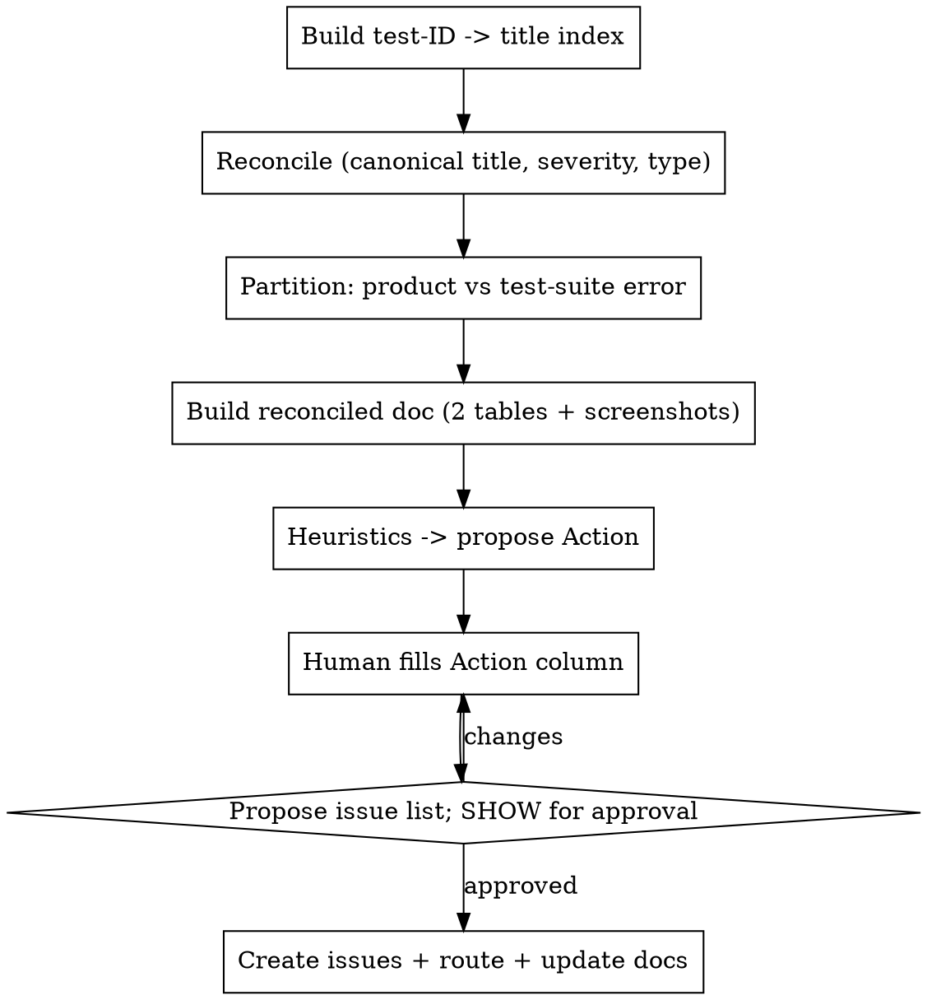

# Bug Bash Triage

Turn a messy findings log into a reconciled triage doc, then — only after the human triages and approves — create issues and route copy fixes. Pairs with **bug-bash-setup**.

Linear-flavored (`LINEAR_API_KEY`); adapt the API for another tracker.

## When to use

- After a bug bash, to reconcile findings and turn them into issues.
- NOT for planning a bash → use **bug-bash-setup**.

## Inputs

- **Raw findings-log doc** (the per-tester tables).
- **Test suite** spreadsheet.
- **Version / release**, and the tracker workspace/team.

## Process

### 0. Locate the inputs
Find the **raw findings-log doc** (created by bug-bash-setup — search your doc tool by a title like `Bug Bash v<X> … Findings Log`) and the **routing docs** (copy/string-review, etc.). The raw log's "who owns what" section lists which suite tabs are in scope. Ask the user only if you can't find them.

### 1. Test-ID → title index
Export each referenced suite tab (CSV per tab). Establish the test-ID convention (often **row order within a tab**). **Match findings by content, not by the reporter's number** — reporters frequently log the spreadsheet row number (= test id + 1) and conventions vary; confirm against the canonical title at that ID and ±1, and record corrections as `(reported #N)`. IDs beyond a tab's range = likely missing/misnumbered — flag them.

### 2. Reconcile + partition (no overlap)
For each finding: canonical title, normalized **Severity** (High/Med/Low), **Type**. Split into **two non-overlapping sets**:
- **Product findings** (bug / polish / enhancement / crash / unclear-behavior).
- **Test-suite errors** (case wrong/outdated, wrong limits, missing case, ambiguous expectation).
A finding lives in **exactly one** table. Dual "bug or wrong-test-expectation" items stay in the product table with a note for QA to verify the case.

### 3. Build the reconciled doc
- **Table 1 — product:** `# · Area · Suite test (ID — title) · Reporter · Type · Finding (actual vs expected) · Severity · Action · Screenshot`. **Carry every screenshot/recording over verbatim** from the raw log (including multi-image rows). Build it sorted by **severity** (Action is empty here); re-sort by Action priority after the human fills it in step 5. The **Action** column is the human's to edit.
- **Table 2 — test-suite errors for QA:** `# · Area · Suite test · Reporter · Problem · Fix needed · Status`, keyed by test ID.
- A short **blocker shortlist** up top + **numbering notes**.

### 4. Triage heuristics (propose Action)
- **Near a release, defer by default.** Reserve "this release" for true blockers: broken media/rendering, crashes, auth/payment/data-loss, and **launch-feature correctness** (wrong entitlements/copy for the headline feature).
- **Cluster duplicate symptoms** into one issue with the variations as scenarios.
- **Copy/messaging → a copy/string-review doc**, not an issue (check it isn't already captured).
- **Couldn't-repro / "ask <reporter>"** → a clarifications-by-person section.
- Ambiguous bug-vs-intended → `Unclear — triage` for a human call.

### 5. STOP — human triages, then approve the issue list
Wait for the human to fill the **Action** column. Then **build the issue list and SHOW it** — titles, target cycle/milestone, status, priority, and **load-balanced assignees** — and get **explicit approval before creating anything**. Creating issues notifies colleagues; never skip this gate. Assign to engineers only; confirm the current roster (it changes) and balance by open-issue load; honor any owner the human named. Query live status/cycle IDs.

### 6. Create issues + route + update docs
- Create each issue with a bug template: **Prerequisites · Steps to Reproduce · Actual Results · Expected Results**, plus screenshots, test IDs, reporter, and a back-link to the reconciled doc.
- **Route copy items** into the copy/string-review doc; comment/relate findings that belong to an existing issue instead of duplicating (search first).
- Update the reconciled doc: add an **Issue / routing** column to Table 1, an **Open questions — clarifications by person** section, and a short summary.
- **Cross-check the raw doc:** add an **"In triage?"** column to each per-tester table marking whether each raw row was captured (catches missed nuances). Append exactly one cell per row and **verify every table keeps a uniform column count before pushing** (image-heavy cells corrupt easily).

## Editing shared docs safely
The human edits these docs between runs. **Never blind-overwrite.** Re-fetch current content, splice surgically (append a column / section), and preserve manual edits (e.g. Action values). When regenerating wholesale, detect and re-apply manual edits first.
