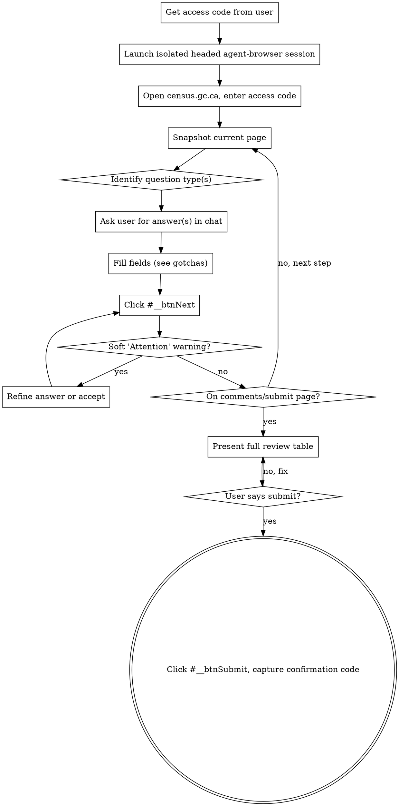

# canada-census

Works for both the **short form** (~10 questions, most households) and the **long form** (1-in-4, adds income, work, education, ethnicity, religion, activities of daily living, etc.), driven with [agent-browser](https://github.com/...).

**Not for**: other StatCan surveys (the WET form quirks transfer, but the question flow differs), or filling a census with invented data — every answer must come from the real respondent.

## Non-negotiable rules

1. **Zero PII in this skill.** Never hardcode names, addresses, dates, or access codes. Every personal answer comes from the live conversation. Do not write answers to disk as part of running the skill.
2. **Never auto-submit.** A census is a legal government filing. Fill everything, then present a complete review table and **wait for the user's explicit "submit"** before clicking Submit. No exceptions.
3. **Accuracy over speed.** These are the respondent's true answers, not plausible guesses. When an answer isn't obvious, ask. Surface anything you inferred so the user can correct it at review.
4. **Ask, don't assume — but don't over-ask.** Batch obvious "No to all" exclusion questions into one confirmation; ask individually for anything identifying or ambiguous (gender, relationship, marital status, languages, income).

## Workflow



### Step 1 — Access code

Ask the user for their **secure access code** (printed on their census letter/invitation; format `1234 5678 9012 3456`). If they don't have one, point them to "Obtain a secure access code" on the login page.

### Step 2 — Launch the browser

Use an **isolated, headed** agent-browser session so the user can watch and you don't collide with any other automation:

```bash
# AGENT_BROWSER_AUTO_CONNECT may be forced in the environment; unset it per-command.
env -u AGENT_BROWSER_AUTO_CONNECT agent-browser --session census --headed open https://census.gc.ca
```

Click **"Start questionnaire"**, enter the access code, click **Start**.

### Step 3 — Page loop (the core)

For each page: **snapshot → identify questions → ask the user → fill → advance.** Re-snapshot every page; refs are invalidated by navigation. The form **dynamically skips** questions based on prior answers (e.g., "question 7 is not applicable, proceed to question 8") — never assume fixed question numbers. See `references/flow-map.md` for the observed step sequence as a guide.

Filling fields is where the StatCan WET form fights back. **Read `references/agent-browser-gotchas.md` before filling anything** — the short version:
- **Radios/checkboxes:** the visible inputs are hidden; `agent-browser check`/`click @ref` sets the value but does **not** fire the `change` event the form's validation needs, so Next silently won't advance. Fix with `eval`: uncheck the group, then native `.click()` on the target.
- **Next button:** there are **two** "Next" buttons; the first is invisible (`class="wb-inv"`). Always click **`#__btnNext`** via `eval`, never a text/role locator.
- **Text & dropdowns** work natively (`fill`, `select`) and fire proper events.

### Step 4 — Soft "Attention" warnings

The form may return a non-blocking **"Attention"** notice (e.g., "be more specific than *Persian* — report *Dari* or *Iranian Persian*"). Refine the answer if the more-specific term is correct, otherwise the user may accept the original by pressing Next again. Confirm the precise term with the user when unsure.

### Step 5 — Review gate (mandatory)

When you reach the **Comments / Submit** page (Step E), STOP. Present a **complete review table** of every question and answer. Flag anything you inferred. Ask the user to verify and explicitly approve. **Only on an explicit "submit" do you continue.**

### Step 6 — Submit & capture

On approval, click **`#__btnSubmit`** via `eval`. Capture the **confirmation code** from the "Thank you" page and a screenshot — this is the respondent's proof of submission. Relay the code to the user and tell them to save it.
