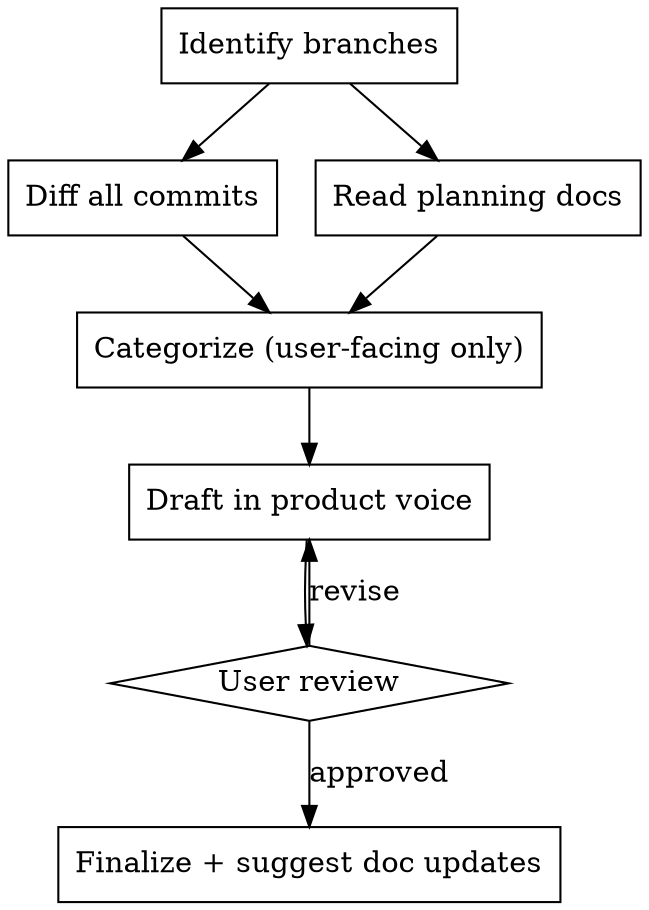

# Release Notes

Write release notes for a new version that match your product's established voice. The hard part is **filtering hundreds of commits down to what users can see** and writing it like you're telling a friend what changed — not reciting a git log.

## When to use

- Preparing a release / writing a changelog / updating the docs-site release notes.
- NOT for internal dev changelogs (those keep refactors/CI/deps).

## Inputs (ask if missing)

- **Version** (e.g. `2.1`).
- **Release branch** (what's shipping) and **base branch** (what's live now). Default base = `origin/release` or `origin/main`.
- **Voice reference** — 2–3 past release notes to match format/tone. If none, ask for the docs-site URL or infer a simple flat-bullet style.

## Process



### 1–2. Branches + full diff
`git fetch origin`, find the release and base branches, then pull **every** commit (`git log --oneline base..target`), paging in chunks of ~200. For 500+ commits, fan out parallel agents over chunks.

### 3. Categorize — user-facing ONLY
Sort commits into buckets: **New features · Plan/limit changes · Section/area improvements · UX improvements · <domain area> · Bug fixes**. **Skip entirely:** refactors, tests, CI/CD, dependency bumps (unless user-visible), docs, dev tooling, merge commits, monitoring/logging, backend internals.

### 4. Draft in product voice
Default format — a flat bullet list under a version header, features first, bug fixes last:

```
## X.Y (Mon DD, YYYY)
- [Biggest new feature first]
- ...
- Fixed a bug where [specific notable fix]
- Other minor bug fixes and improvements
```

Writing rules:
1. Start every bullet with an action verb: `Added…`, `Improved…`, `Increased … from X to Y`, `Fixed a bug where…`.
2. **Exact numbers** for limit changes ("from 3 to 5", never just "increased").
3. Tag plan-gated features (e.g. `(Pro plan)`); add `(learn more)` + link for major ones.
4. User-facing language — "your website", not "the DOM"; name features the way users see them. No internal tech names (frameworks, datastores, infra).
5. One sentence per bullet (max two). 10–20 bullets for a major release, 3–5 for a patch.
6. Bundle minor fixes; give 2–4 specific fixes + one catch-all (`Other minor bug fixes and improvements`).
7. No emoji. Match the version header style of past notes (e.g. `2.1` not `v2.1`).
8. Tone: warm, confident, direct ("Added" not "We've added"); focus on user benefit ("loads up to 90% faster") not implementation ("migrated to static generation").

### 5. Finalize
Output: (1) the formatted notes ready to paste, (2) support/docs articles that likely need updating, (3) suggested new articles for major features.

## Common mistakes

- Including internal changes (refactors, deps, CI) — users don't care.
- Vague limit changes without the before/after numbers.
- Implementation language instead of user benefit.
- Listing every bug fix instead of bundling.
- Drifting from the established header/tone — always match past notes.
